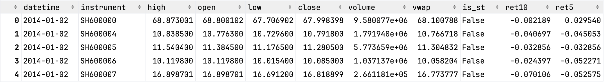
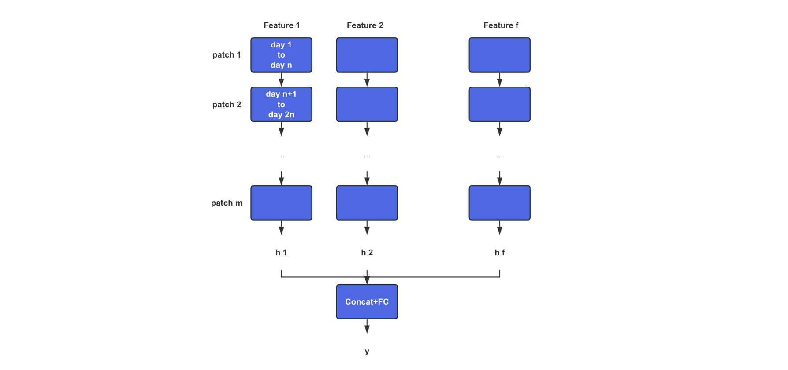
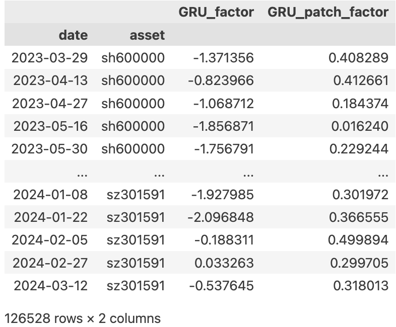
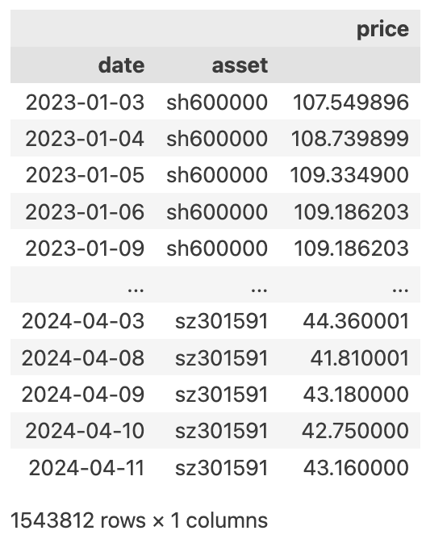
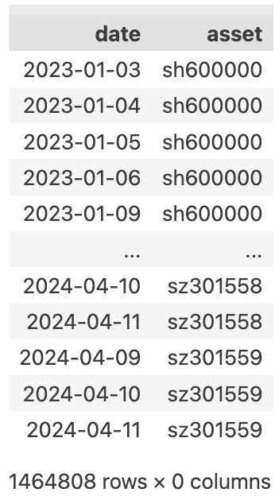
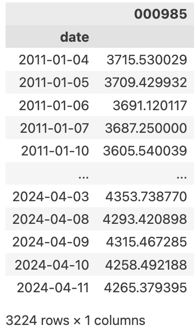
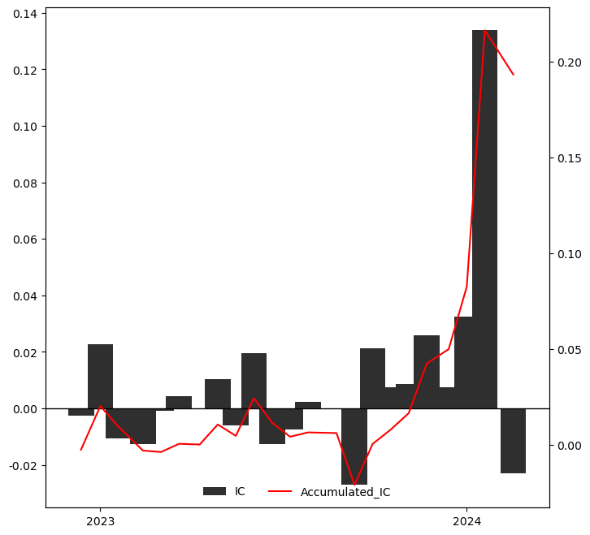
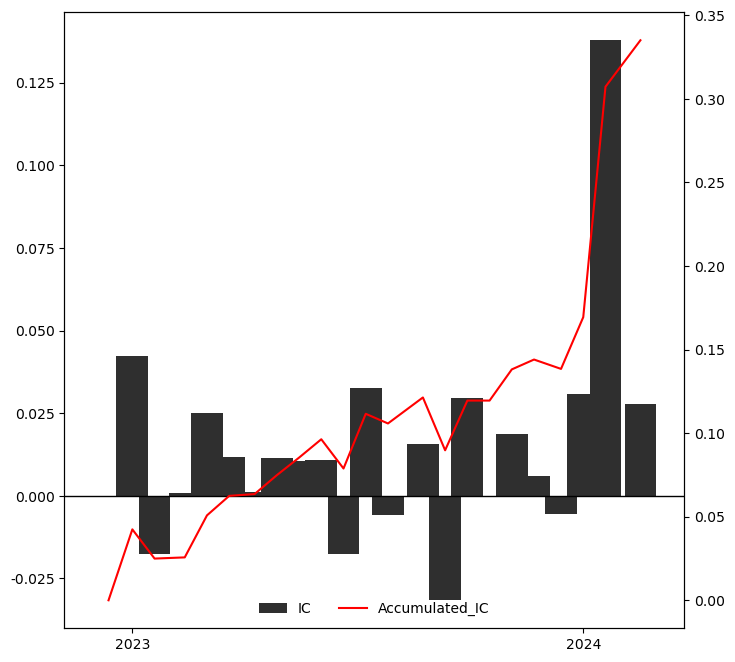
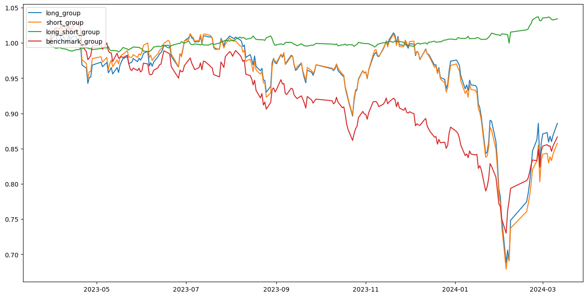
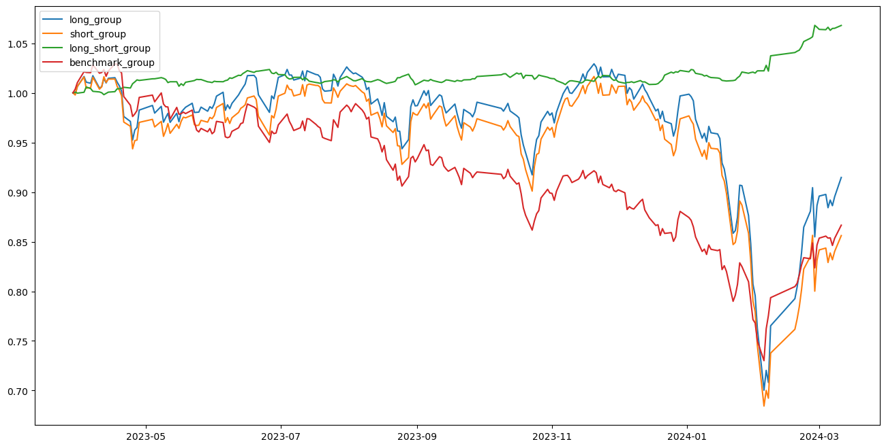

# How to Capture the Patterns of Price and Volume data in Long Time Series

## Team Member

| Student Name | Student ID |
| ------------ | ---------- |
| Li Chang     | 2301212340 |
| Cheng Lei    | 2301212317 |

## Project Introduction

### 1. GRU application on time series data

With the popularization of high-frequency data and the development of computing power, the length of time series data used in quantitative investment is gradually expanding. **A traditional Gated Recurrent Unit (GRU)** is often used to process time series data, a variant of a recurrent neural network (RNN) that is designed to solve the gradient disappearance problem in ordinary RNNS and improve the ability to model long-term dependencies. It controls the flow and forgetting of information by introducing update gates and reset gates, thus effectively capturing important patterns and long-term dependencies in time series data.

### 2. Some drawbacks for GRU

As a classical time series deep learning model, GRU has been widely used in quantitative investment. However, GRU has some shortcomings in processing long time series volume and price data.

- First of all, when the sequence is very long, the GRU will encounter the problem of disappearing gradient and forgetting information.

- Second, high-frequency volume and price data have a certain periodicity, which is difficult for GRU to capture.

- In addition, intraday and daytime information transmission for long time series volume and price data is heterogeneous, but the design of parameter sharing means that the GRU can only process data at all points in time equally.

### 3. Introduce patch design on GRU model

The introduction of patch design in the model can effectively alleviate the shortcomings of GRU. The idea of Patch can be summarized as block processing of data and passing each block into the model as a whole, which has been applied in time series prediction and computer vision and other fields.

In this study, the long-term stock series volume and price data are divided into multiple patches according to the trading day, so that the model can effectively alleviate the problem of information forgetting, and the prior knowledge based on the daily cycle is introduced to analyze the intraday and daytime information transmission differently.

## Data Analysis

### 1. Data source

- **Stock pool:** all A-share stocks from 2014-01-02 to 2024-04-10. 
- **Input features:** daily volume and price data of individual stocks without feature engineering, including **high, open, low, close, volume, vwap**. 
- **Output labels:** t+1 to t+11 return of all stocks. 

#### raw data sample



the raw data is too big, so we don't put it into the repository, click the [link](https://disk.pku.edu.cn/link/AA2715E37E09614D25A07092DE39E4A33A) here to get the raw data if you want to reproduce the program. 

### 2. Data processing

- Exclude the ST stock in that period. 
- Reshape the data to meet the training requirements. After that we get a input dataset whose dimension is **(stock, date, features)**, and a output label whose dimension is **(stock, date)**. 
- Split the whole data into train set, test set and valid set. we use the first 90% of the whole data to train and test our model, last 10% to validate of model. And use the first 80% of the training data as the train set, last 20% as the test set. 

```python
print(X_train.shape, y_train.shape, train_date.shape)  # (5272, 2248, 6) (5272, 2248) (2248,)
print(X_valid.shape, y_valid.shape, valid_date.shape)  # (5272, 250, 6) (5272, 250) (250,)
```


## Model Setting

### 1. Model structure

The model structure is shown in the following figure. 

1. Input data with a dimension of **t x f**, and transform it into a vector with a dimension of **m x n x f** through patching. 
2. Next, for each original feature, GRU is used to extract time series information between patches, with each patch as the time step and the data within the patch as the new feature. 
3. Take the output of the last time step and obtain **f** hidden layers with dimension **h**. 
4. Finally, concatenate the hidden layers of different original features, and then connect them to the fully connected layer to obtain the predicted value. 



### 2. Network structure comparison

Click the model name to see the code of the model. 

| model name                                                   | detailed structure                                           |
| ------------------------------------------------------------ | ------------------------------------------------------------ |
| [GRU baseline](https://github.com/lca-123/PHBS_MLF_2023/tree/master/final_project/model/gru_base.py) | GRU: Input dimension 40 × 6, output dimension 30, with 1 layer.<br/>BN: Batch standardize the output of GRU.<br/>FC: Fully connected layer, input dimension 30, output dimension 1. |
| [GRU patch](https://github.com/lca-123/PHBS_MLF_2023/tree/master/final_project/model/gru_patch.py) | GRU: Input dimension 8 × 5, output dimension 30, 1 layer, quantity 6.<br/>Concat: concatenate the outputs of GRU, with an output dimension of 180.<br/>BN: Batch standardize the output of Concat.<br/>FC: Fully connected layer, input dimension 180, output dimension 1. |

### 3. Training detail

- **features and label**
  - Feature X: The **open, high, low, closing, VWAP and volume** data of an individual stock over the past 40 trading days, with a sequence length of 40.  
  - Label y: The yield of an individual stock over the next 10 trading days (T+1 to T+11). 
  - Feature preprocessing: Each feature is first time series standardized, which means dividing each value of the feature time series by the last value of the sequence. 
  - Label preprocessing: Standardize the cross-section z-score of labels. 
  - Loss function: The inverse of the IC between the predicted value and the label. 
- **model training parameters**
  - Batch size: 5000. 
  - Maximum number of training iteration rounds: 100, number of early stop rounds: 5. 
  - Learning rate: 0.005, optimizer: Adam. 

## Backtest

### 1. Data

The data of Shanghai and Shenzhen A-shares from March 29, 2023 to April 10, 2024 were used to backtest the factors calculated by the model.

- **factors:** The factor data of Bi-weekly frequency (10 days) is extracted from the factor data calculated by the model and sorted into the following data.

</img>

- **price:** The closing price data of all Shanghai and Shenzhen A-shares

</img>

- **pool:** Stock pool data obtained from all Shanghai and Shenzhen A-shares excluding ST, suspension and new shares listed for less than 180 days

</img>

- **benchmark:** Daily closing price of China Stock Index 000985

</img>

### 2. Setting

- GRU_factor and GRU_patch_factor are positive factors, and IC (correlation coefficient between current stock factor value and next stock return) is calculated, and the mean of IC is positive
- Bi-weekly frequency (10 days) adjustment, consistent with the factor after processing
- On each position adjustment day, the stocks in the stock pool are divided into 1-10 groups according to the factor value from small to large. The first group is short, and the 10th group is long. A long_short hedging portfolio is constructed, and the cumulative return of the portfolio is calculated

### 3. Result

- **IC-IR:**

  |                  | IC_Mean      | IC_Std   | IR = IC_Mean/IC_std |
  | ---------------- | ------------ | -------- | ------------------- |
  | GRU_factor       | 0.008401     | 0.031259 | 0.268756            |
  | GRU_patch_factor | **0.014568** | 0.032363 | **0.450135**        |

  **The  Accumulated IC for GRU_factor:**

</img>

**The Accumulated IC for GRU_patch_factor：**

</img>

- The IC_Mean of GRU_patch_factor is about **1.8 times** of GRU_factor, leading to a higher IR value for GRU_patch_factor. And the accumulated IC of GRU_patch_factor is about **0.34** while that of GRU_factor is about **0.18**. 

- **Return:**

  | **factor_quantile**         | Annual Return | Sharp Ratio   |
  | --------------------------- | ------------- | ------------- |
  | 1_group_GRU_factor          | -0.100464     | -0.490375     |
  | 10_group_GRU_factor         | -0.080131     | -0.391451     |
  | 1_group_GRU_patch_factor    | **-0.101550** | **-0.494740** |
  | 10_group_GRU_patch_factor   | **-0.059588** | **-0.315010** |
  | benchmark                   | -0.093992     | -0.672517     |
  | long-short_GRU_factor       | 0.023378      | 0.247522      |
  | long-short_GRU_patch_factor | **0.046369**  | **0.911205**  |

  From this table, we can see the backtest returns for both. For the long-short annual return, the value of GRU_patch_factor is about 2 times of the normal GRU factor.

- **Net value figure:**

  **For GRU_factor:**

</img>

**For GRU_patch_factor:**

</img>

- For comparison, the Net value figure for GRU_patch_factor present a more obvious difference of the long and short group. Although the whole market performs poor during this backtest period, the long-short group of GRU_patch _factor achieves 4.6% positive return. And the excessive return of it is $13.9\%$.

- **Conclusion:**

  From the IC, return and differnce of long-short group, the GRU_patch_factor realizes a pretty good improvement over the GRU_factor.

## File Structure of Our Project

- [backtest](https://github.com/lca-123/PHBS_MLF_2023/tree/master/final_project/backtest): the folder we do the backtest. 
- [code](https://github.com/lca-123/PHBS_MLF_2023/tree/master/final_project/code): the folder including the model trainer and some functions used in the model training. 
- [data](https://github.com/lca-123/PHBS_MLF_2023/tree/master/final_project/data):  the raw and processed data, including a sample factor data as the result after we running the model. 
- [image](https://github.com/lca-123/PHBS_MLF_2023/tree/master/final_project/image): images shown in this file. 
- [model](https://github.com/lca-123/PHBS_MLF_2023/tree/master/final_project/model): two model we used. 
- [data_preprocess.ipynb](https://github.com/lca-123/PHBS_MLF_2023/tree/master/final_project/data_preprocess.ipynb): code we do the data preprocessing.
- [model_train.ipynb](https://github.com/lca-123/PHBS_MLF_2023/tree/master/final_project/model_train.ipynb): code we do the model training and predicting. 